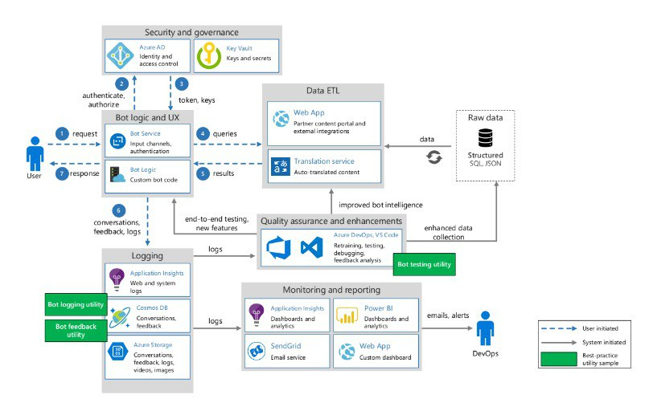
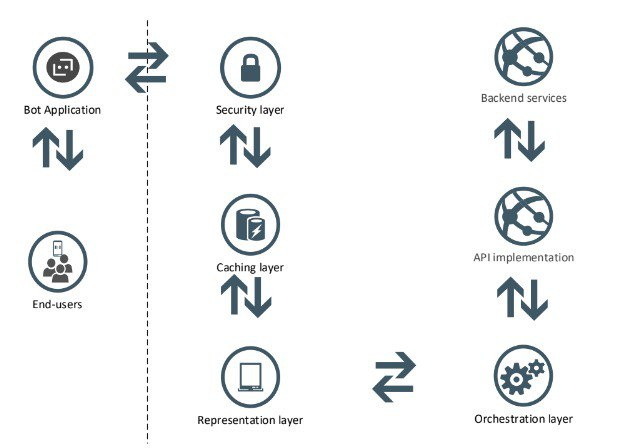
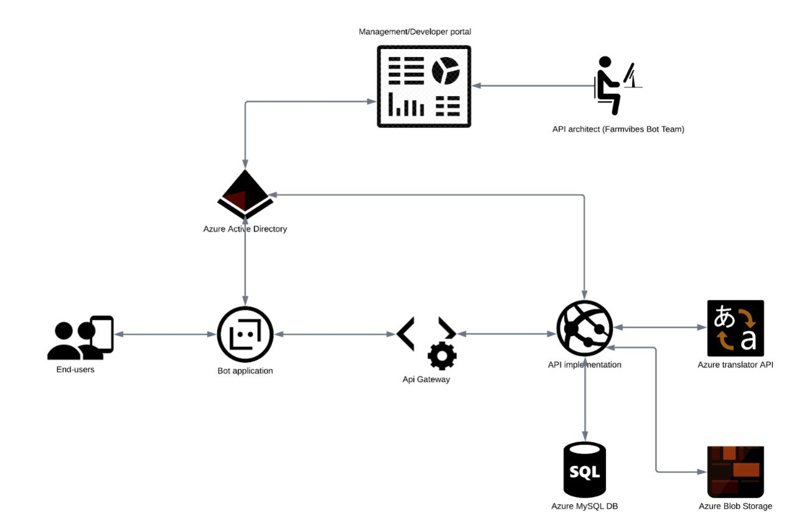

# Farmvibes bot Architecture



**Security layer:** The security layer safeguards the backend systems and data against the outside world, web-based risks, and API-specific vulnerabilities.

**Caching layer:** Caching increases efficiency and performance by caching responses to frequent queries, alleviating pressure on the API implementation and backend resources.

**Representation layer:** This provides an intuitive and well-documented interface that enables internal and external developers to leverage the API and enhance capabilities beyond the Farmvibes default offerings to deliver value to their end customers.

**Orchestration layer:** This enables the synthesis and combining of data and services from many backend and external sources into a single end-user-facing solution.



## API components



**API Gateway:** Provides the security, caching, and orchestration capabilities necessary for the deployment of a core API architecture.

**Management portal:** Provides a fully customizable interface through which developers may access APIs, documentation, and other relevant resources. In the future, if sufficient resources are available, a community can be formed to actively engage and manage developers to ensure they design apps that add business value.

## Farmvibes bot deployment

Farmvibes bot is a chatbot platform built on the Azure bot framework. It comprises a content management API, a content management portal, and a chatbot. It can integrate with multiple platforms such as Teams, Telegram, Messenger, Direct Line (WhatsApp, SMS, USSD, Voice, and web page integration).

Read more on bot framework SDK [here](lhttps://learn.microsoft.com/en-us/azure/bot-service/index-bf-sdk?view=azure-bot-service-4.0).

### Main functionalities of the Farmvibes bot

**Content management API:** This API platform manages entities and the consumption of the data stored in the database. Through the API, data is inserted, updated, and queried from the database. This API uses the [Symfony PHP framework](https://symfony.com/doc/current/index.html).

**Content management portal:** This portal is a user interface used by admin users to manage bot users, languages available in the bot, channels/platforms that connect to the bot, and lastly, to add, edit and update content consumed on the bot. This portal uses [Fluent UI React](https://developer.microsoft.com/en-us/fluentui#/get-started/web).

**Chatbot:** This chatbot manages conversations between a user and the [Azure bot framework](https://learn.microsoft.com/en-us/azure/bot-service/index-bf-sdk?view=azure-bot-service-4.0) through channels such as Telegram, Teams, and Direct Line (such as SMS), among others. It presents content added through the content management portal to the user. The bot logic is built using the .NET core framework. It also uses SQLite as an in-memory tool that stores data in memory after pulling it from the content management API.

### Deployment

The Farmvibes bot depends on several Azure services. Hence an Azure subscription is required.

### Farmvibes Content Management API Deployment

### Prerequisites

- An [Azure account](https://azure.microsoft.com/en-us/free/?WT.mc_id=A261C142F) with an active subscription.
- An [Azure App](https://learn.microsoft.com/en-us/azure/app-service/quickstart-php?tabs=cli&pivots=platform-linux) Service with a runtime of PHP >= 8.0.
- An [Azure translator](https://learn.microsoft.com/en-us/azure/cognitive-services/translator/translator-overview) service.
- An [Azure blob storage](https://learn.microsoft.com/en-us/azure/storage/blobs/storage-blobs-overview) container.
- Azure Database for [MySQL](https://learn.microsoft.com/en-us/azure/mysql/flexible-server/overview) or [PostgreSQL](https://learn.microsoft.com/en-us/azure/postgresql/flexible-server/overview).
- An [Azure AD tenant](https://learn.microsoft.com/en-us/azure/active-directory/develop/quickstart-create-new-tenant).
### Steps

These steps instruct on creating the third-party services and environment variables required to run the API. Ensure to add the variables below in your environment before deploying or in the `.env` file if running the application locally. 

1. Create a database (MySQL or Postgres) and add the database connection string to your environment as follows:
    - `DATABASE URL`= {}

    To connect to your database using MySQL workbench, follow [these steps](https://dev.mysql.com/doc/workbench/en/wb-mysql-connections-new.html).

2. In addition, in the production environment, an SSL connection to the database will be required. You will therefore need to specify the path to the SSL certificate in your code base under `/config/mysqli/`. Follow [these steps](https://learn.microsoft.com/en-us/azure/mysql/single-server/how-to-configure-ssl) to configure your SSL for Azure Database for MySQL.


3. Create an [Azure Translator service](https://learn.microsoft.com/en-us/azure/cognitive-services/translator/translator-overview). This translator service will be required to auto-translate the content to any other language the admin user adds to the platform. From the translator service, add the following keys to your environment:
    - `TRANSLATOR_LANGUAGE_PATH`={}
    - `TRANSLATOR_LOCATION`={}
    - `TRANSLATOR_TEXT_ENDPOINT`={}
    - `TRANSLATOR_TEXT_PATH`={}
    - `TRANSLATOR_TEXT_SUBSCRIPTION_KEY`={}

4. Azure blob storage, an object storage solution for the cloud that stores unstructured data, is used to store media associated with the bot content. Refer to [this documentation](https://docs.microsoft.com/azure/storage/blobs/storage-quickstart-blobs-portal#create-a-storage-account) to create an Azure blob storage account, then copy the connection string from the access keys. Add the connection string to your environment as follows:
    - `BLOB_STORAGE_CONNECTION_STRING`={blob_storage_connection_string}

5. Register an application with the Microsoft identity platform as documented [here](https://docs.microsoft.com/azure/active-directory/develop/quickstart-register-app). The API uses this service to authenticate chatbot and content management portal HTTP requests. Get the client ID and the client secret and add them to your environment as follows:
    - `AZURE_CLIENT_ID`={client_id}
    - `AZURE_CLIENT_SECRET`={client_secret}

    Tip: You can set the sign-in frequency. This is the period before a user is asked to sign again before accessing a resource. For more information on the sign-in frequency and how to configure it, refer to [this documentation](https://docs.microsoft.com/azure/active-directory/develop/howto-add-app-roles-in-azure-ad-apps#configuring-role-inactive-duration).

6. APC User cache is used for caching to speed up the authentication process. For local caching to work, enable APCu in your PHP installation, as shown [here](https://www.php.net/manual/en/book.apcu.php). Add to your environment a random string to be used by the cache prefix as follows:
    - `APCU_ADAPTER_KEY`={random-string}
    - `PHP_INI_SCAN_DIR`={/usr/local/etc/php/conf.d:/home/site/ini}

    For this to work, create a new directory named `ini` under `home/site`. Under `home/site/ini`, create a new file named `php-apcu.ini` and add the following content:
    ```
    extension=/home/site/wwwroot/bin/php-apcu.so
    ```
7. Add the following CORS header to your environment to enable sharing of resources from the chatbot and Farmvibes portal.
    - `CORS_ALLOW_ORIGIN`={^http(s)?://(your_bot_url|your_farmvibes_portal_ulr)(:[0-9]+)?$}

8. The API uses messaging queues, a Symfony message component, to enable long-running tasks to be performed in the background so that they do not block the user from using the UX. The API listens to the `onKernelTerminate` event, which is non-blocking and allows tasks to run without affecting the user. The only drawback is that this will not work well in Windows servers, as new requests will cancel processing. For more information, visit [this documentation](https://symfony.com/doc/current/messenger.html).

    The transport DSN must be specified in the environment, as shown below. Since we have used Doctrine at the start, the following string should suffice: `doctrine://default?auto_setup=0`, which would tell Doctrine to create the required tables in the default connection.
    - `MESSENGER_TRANSPORT_DSN`={doctrine://default?auto_setup=0}

9. Workers which consume the messages need to be restarted with every new deployment. However, adding the command to the `composer.json` file poses the risk of queue blocking the rest of the deployment process to the production environment only. Due to this, the recommendation is to add this to the OS scheduler as a cronjob or systemd as explained in [this documentation](https://symfony.com/doc/current/messenger.html#running-the-worker-as-a-long-running-command) and [this systemd documentation](https://www.freedesktop.org/software/systemd/man/systemd.service.html).

    ```
    php bin/console messenger:consume async --limit=10 --time-limit=3600 --memory-limit=128M
    ```

10. Note: Nginx configuration and setup are required to be able to serve the PHP files. Therefore, if you are deploying to Azure, navigate to your project folder, locate `azure-nginx.conf`, and update the server name. Thereafter, on your app service, add the following command to the startup command:
    ```
    /home/site/wwwroot/startup.sh
    ```

11. The deployment script runs commands to set up the database structure and migrations that insert default values and a default registration service users get when interacting with the bot.

12. To run this API locally, run the `composer install` command on your terminal. This command will set up your database with the default values required for the API and the portal to work. It also creates a default registration service for you that will be presented to the user on the chatbot when they first interact with it.

13. To start the API on your local machine, run `symfony server:start`.

# Farmvibes Portal Deployment

## Prerequisites
- An Azure app service with Node.js is required. To set up the initial environment, follow [these steps](https://learn.microsoft.com/en-us/azure/app-service/quickstart-nodejs?tabs=linux&pivots=development-environment-vscode).
- Ensure the content management API runs well as it queries the database for content manipulation. In addition, for the portal to successfully deploy, it requires the secrets from the app registration with the Microsoft Identity platform done during the API deployment.

## Steps

Add the following keys to your environment when you are deploying this application. If the application runs locally, these environment keys should be updated in the `.env` files.

1. `REACT_APP_API_ENDPOINT`={http://farmvibesapi.com/api/}
   - This key holds the URL to the Farmvibes content management API set up in the above steps.

2. `REACT_APP_TRANSLATIONS_DELAY`=4000
   - The value held in this key specifies the delay allowed for background auto-translations of new content added before submission.

3. `REACT_APP_AZURE_CLIENT_ID`={guid}
   - Copy the client_id from the Azure AD app Registration created during the Farm Vibes content management API setup, and update it to this key.

4. `REACT_APP_TENANT_ID`={guid}
   - Copy the tenant_id from your Azure subscription and update it to this key.

To serve the content correctly, use this as your startup command: `pm2 serve /home/site/wwwroot/ --no-daemon --spa`

The portal uses the `react-intl` package for the translation of the UI to your selected language. To translate the UI to your preferred language, navigate to the codebase's `src/lang/` folder. Copy and rename `en.json` to your selected language and translate the file's contents. For instance, if the UI was originally in English, in the `src/lang/` folder, you will have the `en.json` file. To translate your UI to French for instance, you will need to create a similar file, copy the content in `en.json`, and translate the values to French. Visit [this documentation](https://formatjs.io/docs/react-intl/using-with-message-components) to learn more about `react-intl`.

# Bot Deployment

## Prerequisites
- Ensure that the content management API is running well as it queries the database for content manipulation. In addition, for the bot to successfully deploy, it requires the secrets from the app registration with the Microsoft Identity platform done during the API deployment.
- An Azure subscription is required to set up Azure app service and Azure bot resources. The app service serves as a host for bot application logic, while the Azure bot establishes a connection between bot application logic and the bot framework's established communication channels, such as Telegram, Facebook Messenger, Microsoft Teams, and Direct Line channels like SMS and WhatsApp.
- An Azure app service .Net environment. To create an app service, follow [these steps](https://learn.microsoft.com/en-us/azure/app-service/environment/creation).
- An Azure Bot Service - Follow [these steps](https://learn.microsoft.com/en-us/azure/bot-service/abs-quickstart?view=azure-bot-service-4.0&tabs=userassigned#to-update-your-app-service) to create an Azure bot and configure the Azure bot.

## Steps

Add the following keys to your environment as you deploy the bot service. If you run the bot in the local environment, add the keys in the `appsettings.json` file.

1. `ContentAppUrl`
   - This key holds the URL to the Farmvibes content management API (http://localhost:8000/api/). The bot uses this URL to fetch any new content an admin user adds through the content management portal.

2. `AzureADClientId`
   - Copy the client_id from the Azure AD app Registration created during the Farm Vibes content management API setup, and update it to this key.

3. `AzureADClientSecret`
   - Copy the client secret from the Azure AD app Registration created during the Farm Vibes content management API setup, and update it to this key.

4. `AzureADTenantId`
   - Copy the tenant_id from your Azure subscription and update it to this key.

5. `AzureADScope`
   - Azure AD scope is the client id appended by `/.default` in this format (`app://{client_id}/.default`). For the scope to be exposed, it must be set up on the AD app registration by following [these steps](https://learn.microsoft.com/en-us/azure/active-directory/develop/quickstart-configure-app-expose-web-apis).

6. `AzureBlobStorage`
   - Azure blob storage is an object storage solution for the cloud that stores unstructured data. The bot uses blob storage to log output, such as conversations between the bot and a user. Refer to [this documentation](https://docs.microsoft.com/azure/storage/common/storage-account-create?tabs=azure-portal) to create an Azure blob storage account, then copy the connection string from the access keys.

7. `InstrumentationKey`
   - This is the application's insight access key used to record the bot's application metrics for monitoring, diagnosing, and analyzing the bot, giving insights into the application performance. Follow [these steps](https://docs.microsoft.com/azure/azure-monitor/app/create-new-resource#retrieve-an-instrumentation-key) to get your instrumentation key.

8. `MicrosoftAppId`
   - An application ID and password are secrets associated with the Azure bot. Refer to [this documentation](https://docs.microsoft.com/azure/bot-service/bot-service-resources-bot-framework-authentication?view=azure-bot-service-4.0&tabs=python#generate-an-app-id-and-password) for instructions on how to generate an application ID.

9. `MicrosoftAppPassword`
   - Refer to [this documentation](https://docs.microsoft.com/azure/bot-service/bot-service-resources-bot-framework-authentication?view=azure-bot-service-4.0&tabs=python#generate-an-app-id-and-password) for instructions on how to generate an application password.

10. `RootMenuNodeTypeId`
    - In your database, navigate to the `menu_node_type` table, copy the ID of the menu node type whose column name is "main", and add it as the value associated with this key. This value is also created and written into the database after the API successfully deploys or the 'composer install' command runs locally to set up the content management API.

11. `TimerInterval`
    - Defines the period after which the bot will check for new content from the content management API.

To deploy your bot to Azure, follow these steps.
Follow [these instructions](https://docs.microsoft.com/azure/bot-service/bot-service-manage-channels?view=azure-bot-service-4.0) to connect your bot to channels like Telegram or Direct Line.
The bot framework emulator is an excellent tool if you run the bot in your local environment. This emulator lets you test and debug your chatbot on your local machine. To set up the bot framework emulator, follow [these steps](https://docs.microsoft.com/azure/bot-service/bot-service-debug-emulator?view=azure-bot-service-4.0).